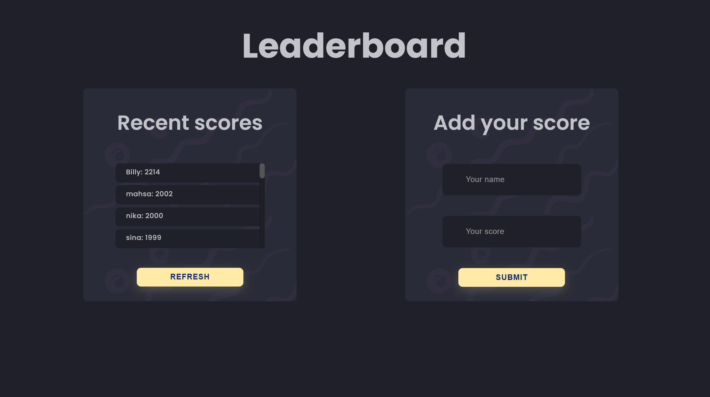

<a name="readme-top"></a>

<h3><b>Leaderboard</b></h3>

<!-- TABLE OF CONTENTS -->

# 📗 Table of Contents

- [📖 About the Project](#about-project)
  - [🛠 Built With](#built-with)
    - [Tech Stack](#tech-stack)
    - [Key Features](#key-features)
  - [🚀 Live Demo](#live-demo)
- [💻 Getting Started](#getting-started)
- [👥 Authors](#authors)
- [🔭 Future Features](#future-features)
- [🤝 Contributing](#contributing)
- [⭐️ Show your support](#support)
- [🙏 Acknowledgements](#acknowledgements)
- [📺 Presentation](#presentation)
- [📝 License](#license)

# 📖 Leaderboard <a name="about-project"></a>

**Leaderboard** The leaderboard website displays scores submitted by different players. It also allows you to submit your score. All data is preserved thanks to the external Leaderboard API service.

<div align="center">

  
  </div>

## 🛠 Built With <a name="built-with"></a>

### Tech Stack <a name="tech-stack"></a>

<details>
  <summary>Client</summary>
  <ul>
    <li>HTML 5</li>
    <li>CSS 3</li>
    <li>JavaScript</li>
    <li>Webpack 5</li>
    </ul>
</details>

## 🚀 Live Demo <a name="live-demo"></a>

- [Live Demo Link](https://billymohajeri.github.io/Leaderboard/dist/)

<p align="right">(<a href="#readme-top">back to top</a>)</p>

<!-- GETTING STARTED -->

## 💻 Getting Started <a name="getting-started"></a>

To get a local copy up and running, follow these steps:

```sh
  git clone git@github.com:billymohajeri/Leaderboard.git
  npm run build
  npm start
```

### Prerequisites

In order to run this project you need:

- Code Editor: VS Code
- Web Browser

<!--
Example commands:

```sh
  cd my-folder
  git clone git@github.com:myaccount/my-project.git
```
--->

<!-- ### Usage

To run the project, execute the following command: -->

<!--
Example command:

```sh
  rails server
```
--->

<!-- ### Run tests

To run tests, run the following command: -->

<!-- ### Deployment

You can deploy this project using: -->

<!--
Example:

```sh

```
 -->

<!-- <p align="right">(<a href="#readme-top">back to top</a>)</p> -->

<!-- AUTHORS -->

## 👥 Authors <a name="authors"></a>

<!-- > Mention all of the collaborators of this project. -->

👤 **Billy Mohajeri**

- GitHub: [@BillyMohajeri](https://github.com/billymohajeri)
- Twitter: [@BillyMohajeri](https://twitter.com/BillyMohajeri)
- LinkedIn: [@BillyMohajeri](https://www.linkedin.com/in/billymohajeri)

<p align="right">(<a href="#readme-top">back to top</a>)</p>

<!-- FUTURE FEATURES -->

<!-- ## 🔭 Future Features <a name="future-features"></a>

- **Add a dynamic button for mobile version**
- **Add form for reserve tickets** -->

<!-- <p align="right">(<a href="#readme-top">back to top</a>)</p> -->

<!-- CONTRIBUTING -->

## 🤝 Contributing <a name="contributing"></a>

Contributions, issues, and feature requests are welcome!

Feel free to check the [issues page](../../issues/).

<p align="right">(<a href="#readme-top">back to top</a>)</p>

<!-- SUPPORT -->

## ⭐️ Show your support <a name="support"></a>

If you like this project, you can support me by giving a ⭐.

<p align="right">(<a href="#readme-top">back to top</a>)</p>

<!-- ACKNOWLEDGEMENTS -->

## 🙏 Acknowledgments <a name="acknowledgements"></a>

<!-- > Give credit to everyone who inspired your codebase. -->

I would like to thank all of my code reviewers for giving me constructive feedback.

<p align="right">(<a href="#readme-top">back to top</a>)</p>

## 📝 License <a name="license"></a>

This project is [MIT](./LICENSE/MIT.md) licensed.

<p align="right">(<a href="#readme-top">back to top</a>)</p>
